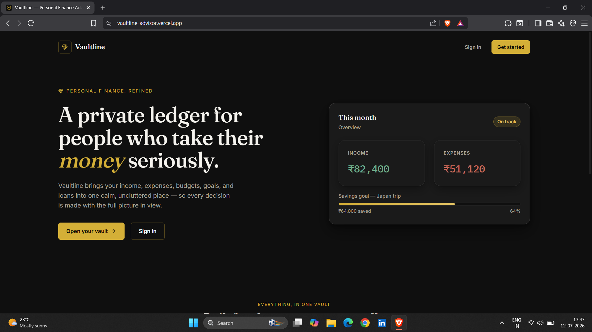
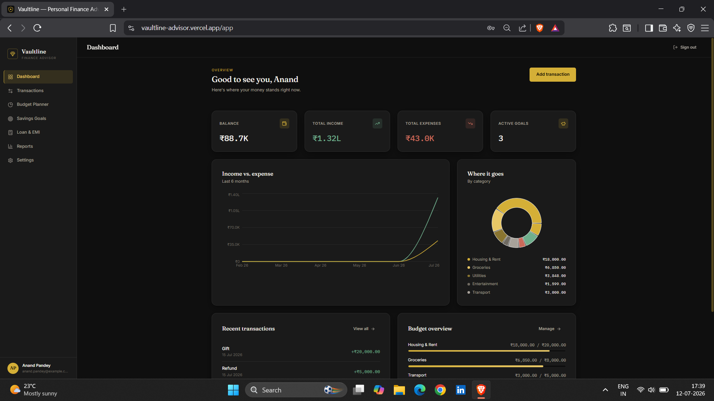
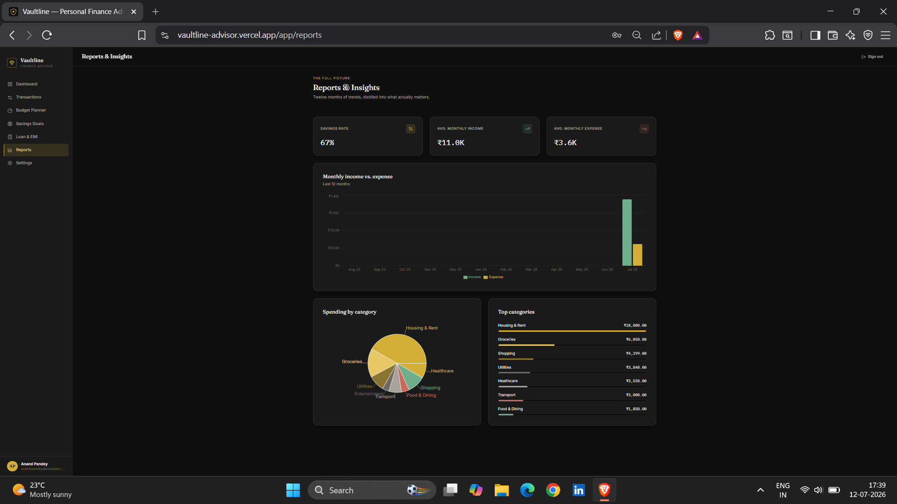
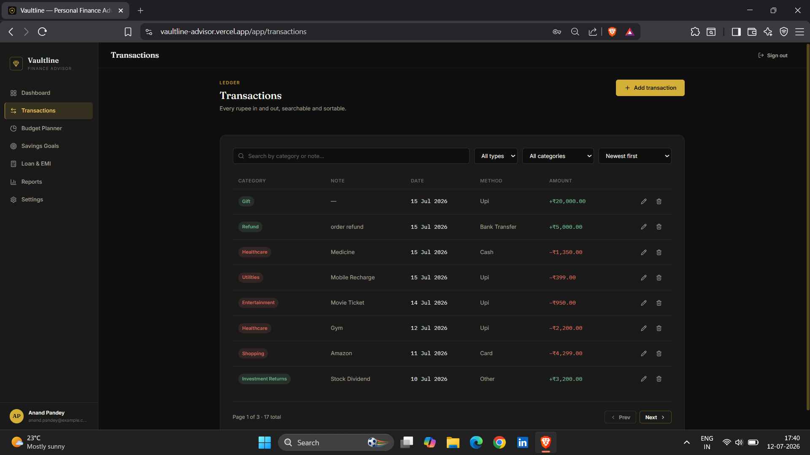
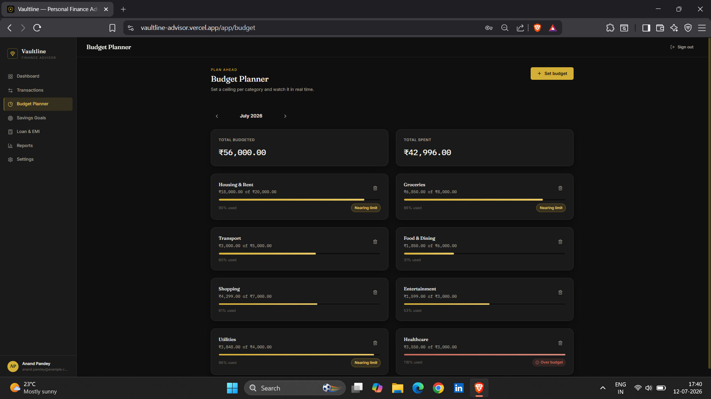
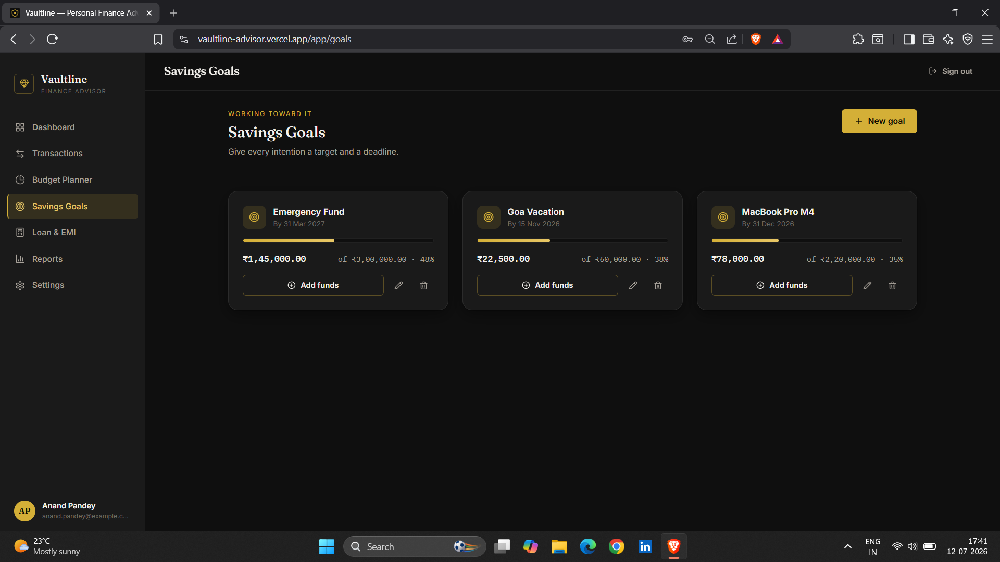
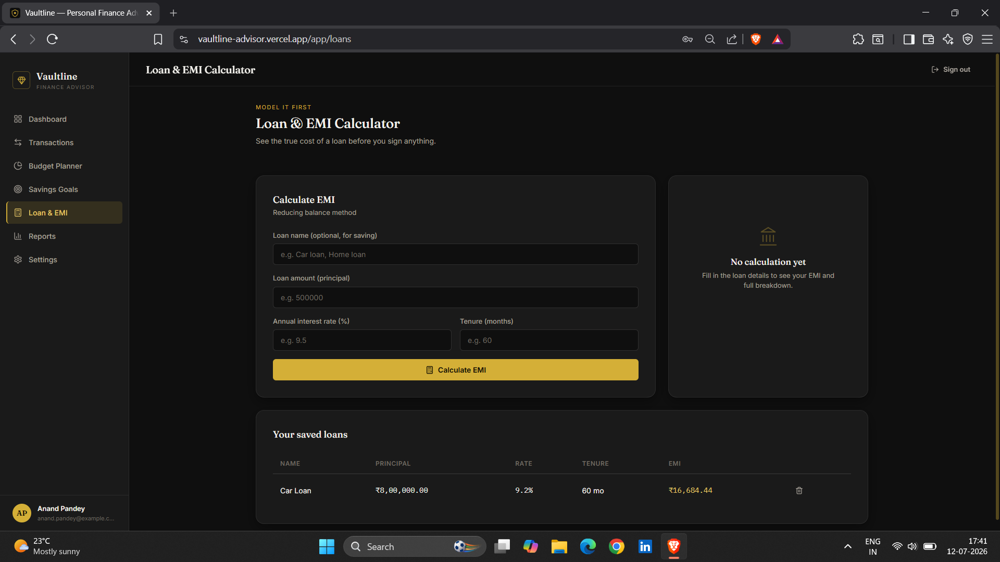
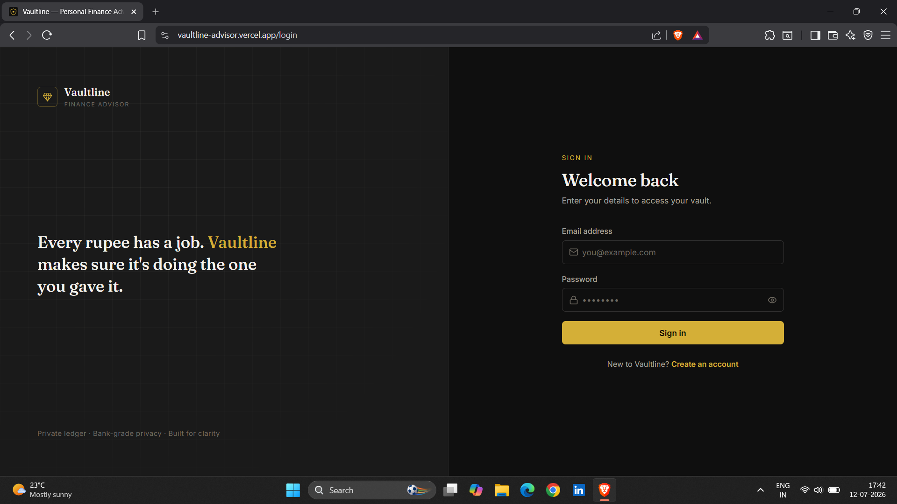
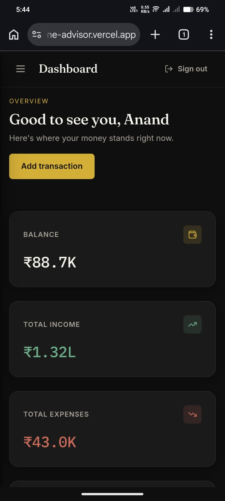

<div align="center">

# 💹 Vaultline

### AI-Powered Personal Finance Advisor

A modern **MERN Stack Personal Finance Management Platform** that helps users securely manage income, expenses, budgets, savings goals, and financial insights through a responsive dashboard with interactive analytics.

<p align="center">

<a href="https://vaultline-advisor.vercel.app/">

</a>

<a href="https://github.com/anand16-info/Vaultline">

</a>

</p>

<p align="center">


</p>

**Track Income • Control Expenses • Plan Budgets • Achieve Savings Goals • Make Smarter Financial Decisions**

</div>

---

# 📖 Overview

Vaultline is a full-stack personal finance management application built using **React, Vite, Node.js, Express.js, and MongoDB**. It enables users to securely track income and expenses, monitor budgets, manage savings goals, calculate loan EMIs, and analyze spending trends through an intuitive dashboard.

The application follows a clean **Luxury Minimal** design with a black-and-gold theme while focusing on performance, usability, and secure financial data management. JWT authentication, RESTful APIs, and MongoDB provide a scalable foundation for a modern finance platform suitable for both personal budgeting and academic demonstration.

---

# ✨ Features

### 🔐 Authentication

- Secure User Registration & Login
- JWT Authentication
- Protected Routes
- Profile Management
- Password Change
- bcrypt Password Hashing

### 📊 Finance Dashboard

- Account Balance Overview
- Income & Expense Summary
- Monthly Financial Statistics
- Recent Transactions
- Spending Analytics
- Category Breakdown Charts

### 💳 Transaction Management

- Add, Update & Delete Transactions
- Search & Filter
- Category Management
- Income & Expense Tracking
- Pagination & Sorting

### 💰 Budget Planner

- Monthly Category Budgets
- Live Spending Tracker
- Budget Status Indicators
- Remaining Budget Calculation

### 🎯 Savings Goals

- Create Savings Goals
- Progress Tracking
- Fund Contributions
- Automatic Goal Completion

### 🏦 Loan & EMI Calculator

- EMI Calculation
- Amortization Schedule
- Loan Tracking
- Monthly Payment Breakdown

### 📈 Reports & Insights

- Monthly Trends
- Savings Rate
- Expense Categories
- Financial Overview

---

# 📸 Screenshots

<p align="center">

</p>

| Dashboard           | Analytics           |
| ------------------- | ------------------- |
|  |  |

| Transactions        | Budget Planner      |
| ------------------- | ------------------- |
|  |  |

| Savings Goals       | Loan Calculator     |
| ------------------- | ------------------- |
|  |  |

| Login               | Mobile View                             |
| ------------------- | --------------------------------------- |
|  |  |

---

# 🛠 Tech Stack

| Layer      | Technologies                                                |
| ---------- | ----------------------------------------------------------- |
| Frontend   | React 18, Vite, React Router, Axios, Recharts, Lucide Icons |
| Backend    | Node.js, Express.js, JWT, bcryptjs                          |
| Database   | MongoDB, Mongoose                                           |
| Deployment | Vercel, MongoDB Atlas                                       |

---

# 📂 Project Structure

```text
Vaultline
├── client
│   ├── components
│   ├── pages
│   ├── context
│   ├── hooks
│   ├── services
│   ├── styles
│   ├── utils
│   └── routes
│
├── server
│   ├── config
│   ├── controllers
│   ├── middleware
│   ├── models
│   ├── routes
│   └── utils
│
└── docs/screenshots
```

---

# 🚀 Getting Started

### Clone Repository

```bash
git clone https://github.com/anand16-info/Vaultline.git

cd Vaultline
```

### Backend

```bash
cd server
npm install
npm run dev
```

### Frontend

```bash
cd client
npm install
npm run dev
```

Open **http://localhost:5173** to start using the application.

---

# ⚙️ Environment Variables

### server/.env

```env
PORT=5000
MONGO_URI=your_mongodb_connection
JWT_SECRET=your_secret_key
JWT_EXPIRES_IN=7d
CLIENT_URL=http://localhost:5173
```

### client/.env

```env
VITE_API_URL=http://localhost:5000/api
```

---

# 🚀 Future Enhancements

- AI Financial Advisor
- Expense Forecasting
- Recurring Transactions
- Bank Account Integration
- PDF Reports
- Email Notifications
- Dark & Light Themes
- Multi-Currency Support
- Cloud Backup
- PWA Support

---

# 👨‍💻 Developer

**Anand Pandey**

🌐 **Live Demo**  
https://vaultline-advisor.vercel.app/

💻 **GitHub Repository**  
https://github.com/anand16-info/Vaultline

---

# ⭐ Support

If you found this project helpful, consider giving it a **Star ⭐** on GitHub. Contributions, feature requests, and feedback are always welcome.

---

<div align="center">

### 💹 Manage Better. Save Smarter. Grow Faster.

**Made with ❤️ by Anand Pandey**

</div>
